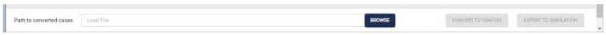

..
  *******************************************************************************
    Copyright (c) 2023 Hexad GmbH

    This program and the accompanying materials are made available under the
    terms of the Eclipse Public License 2.0 which is available at
    http://www.eclipse.org/legal/epl-2.0.

    SPDX-License-Identifier: EPL-2.0
  *******************************************************************************

.. _prepare_simulations:

Prepare the simulation configurations
=====================================

Navigation
----------

For configuring simulations, there are two navigational paths available. You can either access the options through the side menu or when on the homepage, select it directly from one of the central options displayed on the screen.

Screen sections
===============

In the image below, you can observe the default screen that you will encounter after navigating to "Prepare Simulation Configuration."

Within this screen, you will discover four distinct sections.

1. Agents
----------
These agents are imported from the global setup and play a pivotal role as contributing elements in the simulation.

Should users wish to modify the agents, they can be done within this section, tailored specifically for this simulation.

2. Tabs
-------
You have the option to choose the type of simulation.

3. IDs
------
In this section, you can import an iDs list file, apply filters, and make selections for exporting.

4. Export
---------
Finally, at the bottom, there is a bar that provides various options for exporting the selected iDs as an XML file.

Experiment ID Section
=====================

In the this ssection, you can import an IDs XML file as we saw in the last guide section. Now we will see all the available options.

Import XML
----------
Before beginning to work with the iDs, it is necessary to import an XML file. A modal window will open, displaying your computer's file system, allowing you to navigate and select the appropriate file containing all the necessary iDs for import.

Select iDs
----------
To proceed with exporting, it's necessary to select certain iDs. By default, all iDs are unselected, which is why the export option remains unavailable.

You will have various methods to select the iDs.

* Checkboxes

You can select the iDs by clicking on the respective checkboxes. You can repeat this action as many times as needed.

* Dropdown

If you open the dropdown menu located above the bar, which is situated after the XML Path section, you will find the option to either select or unselect all the iDs.

* Search

Within the same bar, you can utilize the search input to filter the iDs and locate the specific iD you're looking for.

* Filters

Lastly, you can also select iDs by importing an XML file, which serves as a method to filter the iDs.

Export section
==============

After selecting at least one iD, the export options will become accessible.

Remember, it's essential to ensure that you've selected all the necessary iDs before proceeding with the export.

Path to converted cases
-----------------------
If necessary, you have the option to modify the export file by utilizing the corresponding input within the export bar. However, please note that this action is not obligatory.

A new modal will open, displaying your computer's folder system. This way, you can select the new appropriate location.

Ultimately, the new location will be displayed in the corresponding section.

Convert to configs
------------------
Prior to exporting, it's essential to convert all the information into an XML file. You can achieve this by clicking on the designated button assigned for this purpose.

.. image:: ../../_static/use_cases/UC3/pcm-exported-to-configs.jpg

Export to simulation
--------------------
The final step involves exporting to simulation after clicking on the Export so simulation button this dialog will appear.

An XML file will be generated and saved in the designated location. By navigating through your computer's file system, you will be able to locate the generated XML file.

