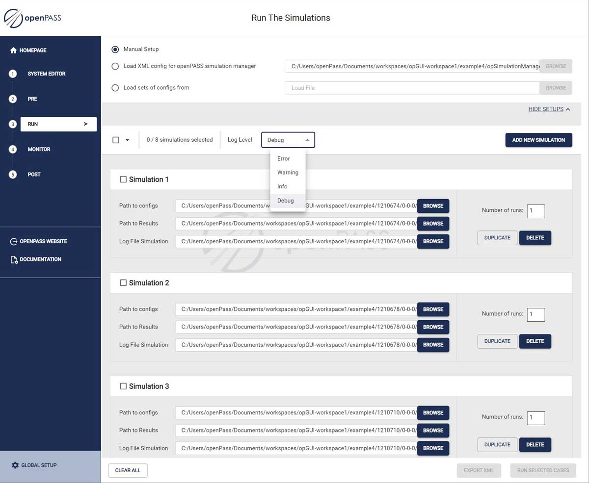

..
  *******************************************************************************
    Copyright (c) 2023 Hexad GmbH

    This program and the accompanying materials are made available under the
    terms of the Eclipse Public License 2.0 which is available at
    http://www.eclipse.org/legal/epl-2.0.

    SPDX-License-Identifier: EPL-2.0
  *******************************************************************************

.. _run_simulations:

Run the simulations
===================

Navigation
----------

For run simulations, there are two navigational paths available. You can either access the options through the side menu or when on the homepage, select it directly from one of the central options displayed on the screen.

.. image:: ../../_static/use_cases/UC2/homepage.jpg

Screen sections
===============

In the image below, you can observe the default screen that you will encounter after navigating to "Run the simulations."

Within this screen, you will discover four distinct sections.

1. Import
---------
In this section, users can choose the method for importing simulations to work on.

2. Simulations
--------------
Here, a management bar for simulations is available. A list is displayed containing all imported simulations, or the list is empty if starting from scratch.

3. Export
---------
Lastly, there is a bar providing the option to clear all created or imported simulations and to export them.

Import
======

Users have three distinct options for importing simulations.

* Manual setup
  The manual setup provides a hands-on approach to creating simulations one by one. The user should add each path.

* Load XML config for openPASS simulation manager
  Users can import an XML file from their computer, which contains a list of simulations.

* Load sets of config from
  Users can import a folder from their computer. This folder should include one or more XML files to import simulations into the list.

Simulations
===========

In this section, users can explore two distinct subsections.

1. Action bar
-------------

In the action bar, the user has the following options:

2. Dropdown
-----------

By opening the dropdown, users can choose to either select or unselect all simulations.

3. Filter by log level
----------------------

Users can filter simulations based on different log levels.

4. Call to action to add a new simulation
-----------------------------------------

A button is provided for users to initiate the creation of a new simulation from scratch.

Simulations list
================

Above the bar, users will find the simulations list, with each simulation featuring individual actions:

1. A bar displaying the simulation's name and a checkbox for selecting the simulation, which is useful for future exporting.

.. image:: ../../_static/use_cases/UC2/run-simulation-1.jpg

2. The configuration list for the simulation's path.

3. The current number of runs for this simulation when all selected simulations are executed.

4. A "Duplicate" option that replicates all paths within the same simulation.

5. An individual delete action, which solely removes the specific affected simulation.

Export
======

In the last section, users will encounter a bar featuring common actions for all simulations or the selected ones.

- Clear all
  This action will remove all simulations from the list, regardless of whether they are selected or not.

- Export XML
  Prior to "Running Selected Cases," users need to export all selected simulations into an XML file.

- Run selected simulations
  Lastly, users should initiate the "Run Selected Simulations" action. All the chosen simulations will be executed with the specified number of runs.

